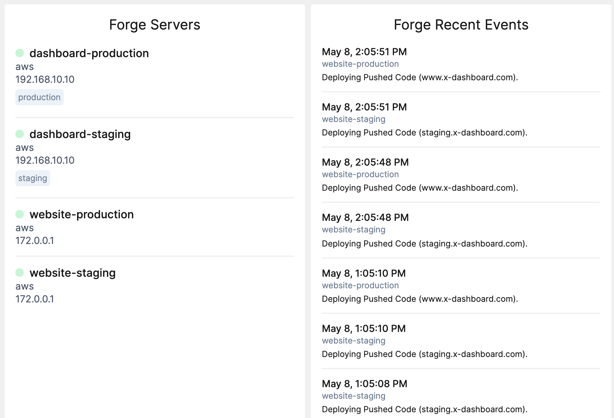

# Forge Tile

Displays Forge Servers and Recent Events.



This tile can be used on [the Laravel Dashboard]https://docs.spatie.be/laravel-dashboard).

## Installation

You can install the package via composer:

```bash
composer require aglipanci/laravel-dashboard-forge-tile
```

## Usage
In the `dashboard` config file, you must add this configuration in the `tiles` key.

```php
// in config/dashboard.php

return [
    // ...
    'tiles' => [
         'forge' => [
              'token' => env('FORGE_API_TOKEN'),
              'servers' => [
                   'refresh_interval_in_seconds' => 60
               ],
              'recent_events' => [
                    'refresh_interval_in_seconds' => 60
              ],
         ],
    ],
];
```

In `app\Console\Kernel.php` you should schedule the below to run every `x` minutes. Only add the commands where you have configured the related tiles above. 

```php
// in app/console/Kernel.php

protected function schedule(Schedule $schedule)
{
    $schedule->command(aglipanci\ForgeTile\Commands\FetchForgeServersCommand::class)->everyThirtyMinutes();
    $schedule->command(aglipanci\ForgeTile\Commands\FetchForgeRecentEventsCommand::class)->everyThirtyMinutes();
}
```

In your dashboard view you can use the `livewire:forge-server-tile` and `livewire:forge-recent-events-tile` component.

```html
<x-dashboard>
    <livewire:forge-server-tile position="a1"/>
    <livewire:forge-recent-events-tile position="b1"/>
    ...
</x-dashboard>

```

## Testing

``` bash
composer test
```

## Changelog

Please see [CHANGELOG](CHANGELOG.md) for more information on what has changed recently.

## Contributing

Please see [CONTRIBUTING](CONTRIBUTING.md) for details.

## Security

If you discover any security related issues, please email [agli.panci@gmail.com](mailto:agli.panci@gmail.com) instead of using the issue tracker.

## Credits

- [All Contributors](../../contributors)

## License

The MIT License (MIT). Please see [License File](LICENSE.md) for more information.
